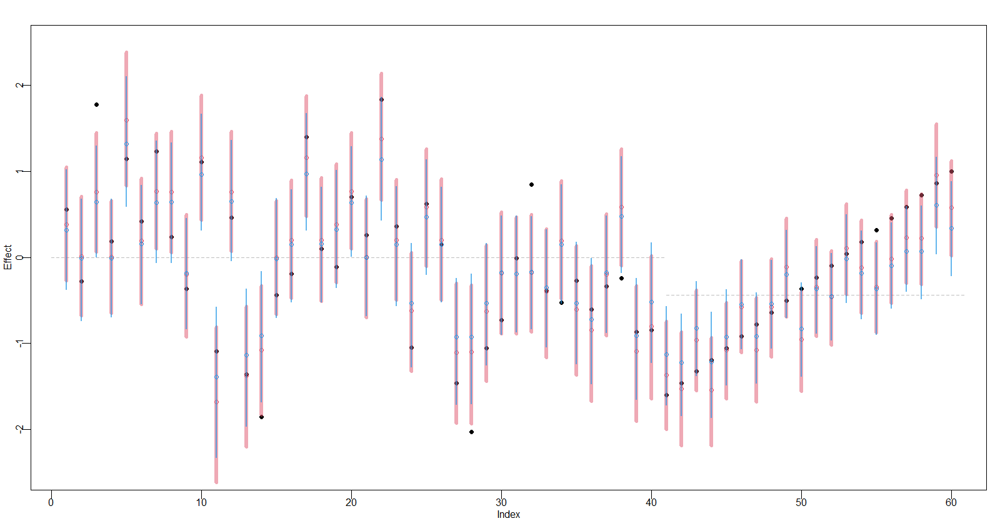
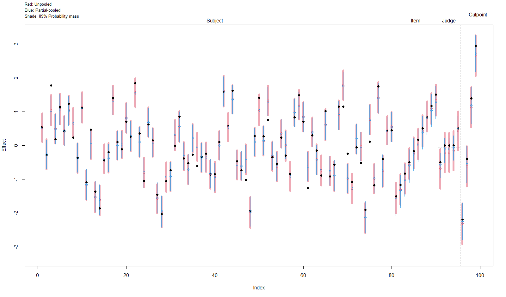

Miscellaneous Functions for Statistical Modeling
================================================

## Item Response Theory

- Rasch Model (1-Parameter Logistic Model)

    [`RaschModel.bayes.R`](https://github.com/liao961120/stom/tree/main/inst/irt/1PL/RaschModel.bayes.R)
    

- Rating Scale Model (Person/Item/Judge effects)

    [`RatingScaleModel.bayes.R`](https://github.com/liao961120/stom/tree/main/inst/irt/RatingScale/RatingScaleModel.bayes.R)
    
