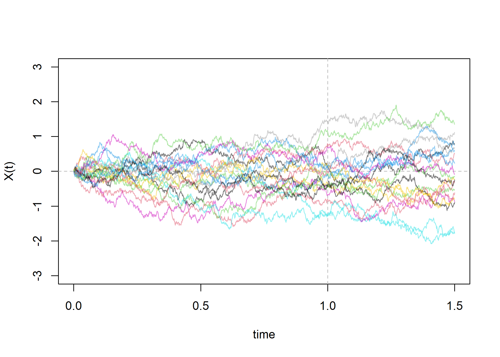
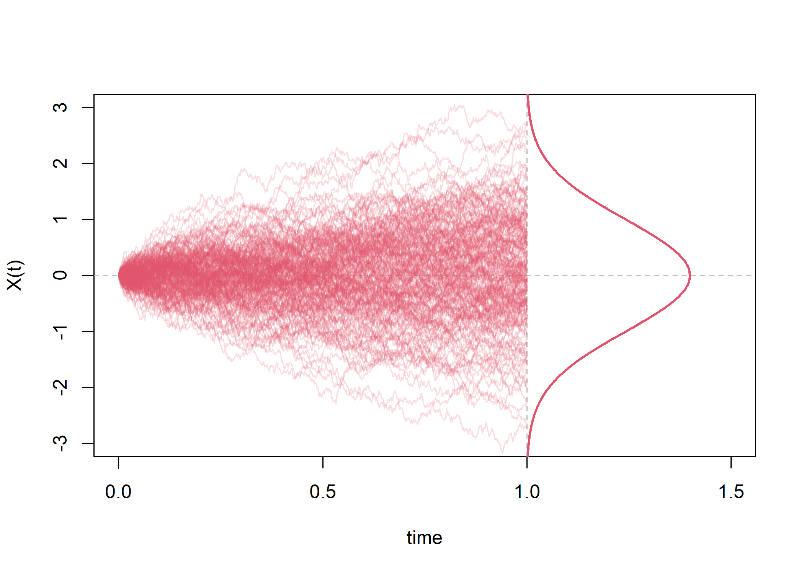
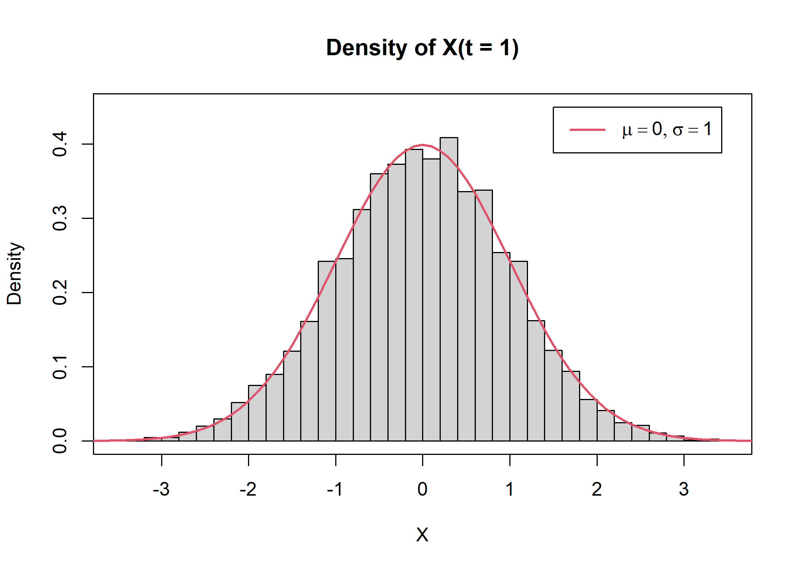
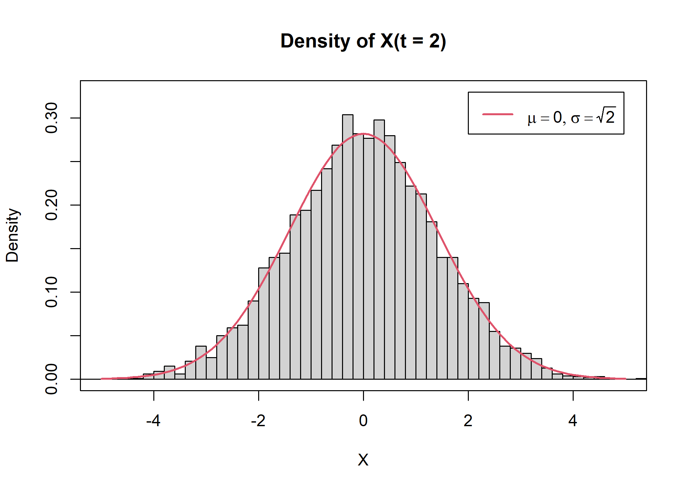
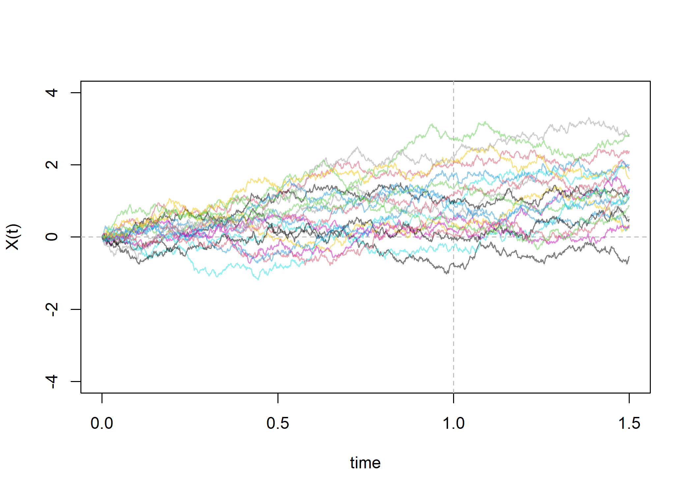
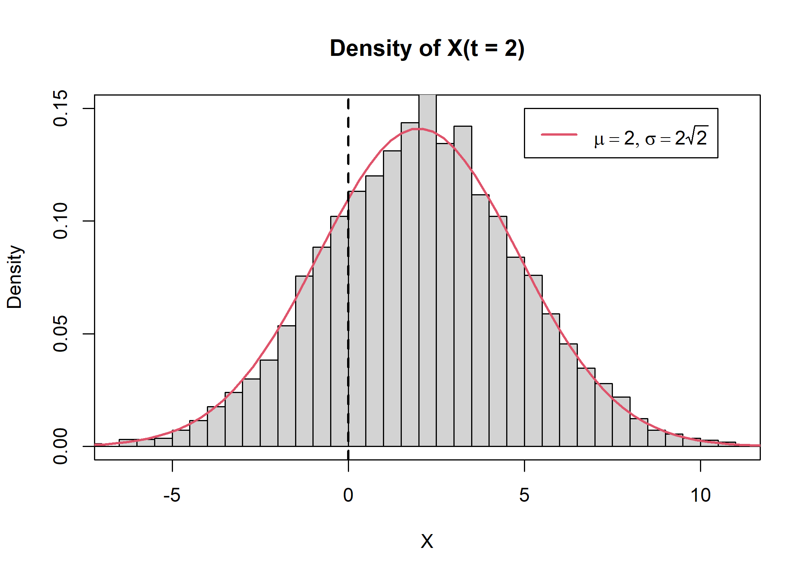
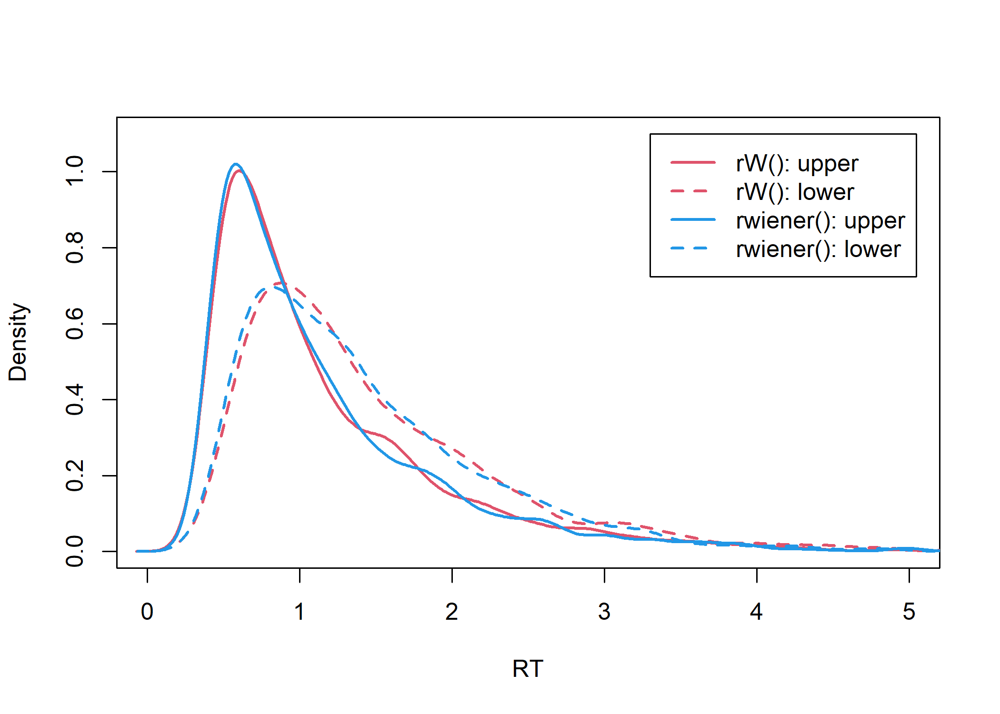

``` r
library(latex2exp)
col.alpha = function (acol, alpha = 0.5) {
  acol <- col2rgb(acol)
  acol <- rgb(acol[1]/255, acol[2]/255, acol[3]/255, alpha)
  acol
}
```

## Standard Brownian motion

### Numerical Approximation

$$
W(t_{i+1}) = W(t_i) + \sqrt{t_{i+1} - t_i} Z_{i+1}
$$

``` r
W = function(t=1, dt=.001) {
    ts = seq(0, t, by=dt)
    N = length(ts) - 1
    Z = rnorm(N)  # standard normal
    w = rep(0, N+1)
    for (i in 2:(N+1))
        w[i] = w[i-1] + sqrt(dt) * Z[i-1]
    return(list(w = w, ts = ts))
}
```

``` r
set.seed(2024)
R = 20
t = 1.5
x = replicate(R, W(t=t)$w)
ts = W(t=t)$ts

plot(1, xlab="time", ylab="X(t)", type="n", xlim=c(0,t), ylim=c(-3,3))
abline(v = 1, col="grey", lty="dashed")
abline(h = 0, col="grey", lty="dashed")
for (r in 1:R)
    lines( ts, x[,r], col=col.alpha(r) )
```



``` r
R = 200
t = 1
x = replicate(R, W(t=t)$w)
ts = W(t=t)$ts

plot(1, xlab="time", ylab="X(t)", type="n", xlim=c(0,1.5), ylim=c(-3,3))
abline(v = 1, col="grey", lty="dashed")
abline(h = 0, col="grey", lty="dashed")
for (r in 1:R)
    lines( ts, x[,r], col=col.alpha(2,.2) )

s = seq(-5,5,by=.01)
lines( dnorm(s)+1, s, col=2, lwd=2 )
```



### Validation

$$
f_t(x) = \frac{1}{\sqrt{2 \pi t}} \exp\left(-\frac{x^2}{2 t}\right)
$$

``` r
# Simulate positions at t=1 for 5000 Brownian motions
set.seed(2024)
x = replicate(5000, rev(W(t=1)$w)[1])
```

``` r
plot(1, type="n", xlab="X", ylab="Density", 
     main = "Density of X(t = 1)",
     xlim=c(-3.5,3.5), ylim=c(0,.45))
hist(x, probability=T, add=T, breaks=50)
curve(dnorm(x), from = -5, to=5, add=T, col=2, lwd=2)
legend(1.5, .45, legend=TeX("$\\mu=0, \\sigma=1$"), col=2, lwd=2)
```



``` r
# Simulate positions at t=2 for 5000 Brownian motions
x = replicate(5000, rev(W(t=2)$w)[1])
```

``` r
plot(1, type="n", xlab="X", ylab="Density", 
     main = "Density of X(t = 2)",
     xlim=c(-5,5), ylim=c(0,.33))
hist(x, probability=T, add=T, breaks=50)
curve(dnorm(x,0,sqrt(2)), from = -5, to=5, add=T, col=2, lwd=2)
legend(2, .33, legend=TeX("$\\mu=0, \\sigma=\\sqrt{2}$"), col=2, lwd=2)
```



## Brownian motion with drift (and scale)

### Numerical Approximation

$$
X(t_{i+1}) = X(t_i) + \mu (t_{i+1} - t_i) + \sigma \sqrt{t_{i+1} - t_i} Z_{i+1}
$$

``` r
W2 = function(drift=1, scale=1, t=1, dt=.001) {
    ts = seq(0, t, by=dt)
    N = length(ts) - 1
    Z = rnorm(N)  # standard normal
    w = rep(0, N+1)
    for (i in 2:(N+1))
        w[i] = w[i-1] + drift*dt + scale*sqrt(dt)*Z[i-1]
    return(list(w = w, ts = ts))
}
```

``` r
R = 20
t = 1.5
x = replicate(R, W2(t=t, drift=1)$w)
ts = W2(t=t)$ts

plot(1, xlab="time", ylab="X(t)", type="n", xlim=c(0,t), ylim=c(-4,4))
abline(v = 1, col="grey", lty="dashed")
abline(h = 0, col="grey", lty="dashed")
for (r in 1:R)
    lines( ts, x[,r], col=col.alpha(r) )
```



### Validation

$$
 f_t(x) = \frac{1}{\sigma \sqrt{2 \pi t}} \exp\left[-\frac{1}{2  \sigma^2 t} (x - \mu t)^2\right]
$$

``` r
x = replicate(5000, rev(W2(drift=1, scale=2, t=2)$w)[1])
```

``` r
# Simulate positions at t=1 for 5000 Brownian motions (drift=1, scale=2)
plot(1, type="n", xlab="X", ylab="Density", 
     main = "Density of X(t = 2)",
     xlim=c(-6.5,11), ylim=c(0,.15))
hist(x, probability=T, add=T, breaks=50)
curve(dnorm(x,1*2, 2*sqrt(2)), from=-15, to=15, add=T, col=2, lwd=2)
abline(v = 0, col=1, lty="dashed", lwd=2)
legend(5, .15, legend=TeX("$\\mu=2, \\sigma=2 \\sqrt{2}$"), col=2, lwd=2)
```



## Wiener First Passage Time Distribution

``` r
rW = function(n, alpha=1, bias=0, drift=1, tau=.1, scale=1, dt=.001) {
    b = c("upper", "lower")
    d = list(q=rep(NA_real_,n), resp=rep(NA_character_,n))
    for (i in seq(n)) {
        t = 0
        w = alpha * bias  # initial condition
        while (0 < w && w < alpha) {
            w = w + drift*dt + scale*sqrt(dt)*rnorm(1)
            t = t + dt
        }
        d$q[i] = tau + t
        d$resp[i] = b[(w<0)+1]
    }
    data.frame(d)
}
```

### Validation

``` r
library(RWiener)

# Params
alpha = 2
bias = beta = 0.6
drift = delta = 0.1
tau = 0.3

# Check simulation by comparing to functions in RWiener
N = 5000
x = rW(N, alpha=alpha, bias=bias, drift=drift, tau=tau)
x2 = rwiener(N, alpha=alpha,beta=bias,delta=drift,tau=tau)
```

``` r
plot(1, type="n", xlab="RT", ylab="Density", ylim=c(0,1.1), xlim=c(0,5))
lines(density(x$q[x$resp == "upper"]), lwd=2, col=2 )
lines(density(x$q[x$resp == "lower"]), lwd=2, col=2, lty=2)

lines(density(x2$q[x2$resp == "upper"]), lwd=2, col=4)
lines(density(x2$q[x2$resp == "lower"]), lwd=2, col=4, lty=2)

legend(3.3, 1.1, 
       legend = c("rW(): upper", "rW(): lower", "rwiener(): upper", "rwiener(): lower"),
       col    = c(2, 2, 4, 4),
       lty    = c(1, 2, 1, 2),
       lwd    = 2)
```



## See Also

- Wabersich, D., & Vandekerckhove, J. (2014). The RWiener package: An R
  package providing distribution functions for the wiener diffusion
  model. The R Journal, 6(1), 49–56.
  https://doi.org/10.32614/RJ-2014-005
- https://www.quantstart.com/articles/brownian-motion-simulation-with-python/
- https://www.randomservices.org/random/brown/Standard.html
- https://www.randomservices.org/random/brown/Drift.html
- https://mc-stan.org/docs/functions-reference/wiener-first-passage-time-distribution.html
