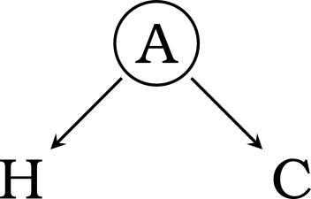

```{r setup, include=FALSE}
knitr::opts_chunk$set(
	echo = TRUE,
	message = FALSE,
	warning = FALSE,
	dev = "svg"
)
```

This is a toy example demonstrating how confounding can arise in statistical modeling. There are many many great examples out there, but I find the example here quite illuminating. Note that this example is presented **only for demonstration purposes** and does not intend to suggest anything about the empirical findings. We simply need better-designed studies to elucidate the relationship between coffee consumption and health. This demonstration, however, still serves well to (re)emphasize the importance of being careful with causal claims.


Is coffee good for health?
--------------------------

There is accumulating evidence showing that the amount of [coffee intake is associated with health outcomes][wiki]. In particular, it was found that having more coffee is associated with lower all-cause mortality, in a reasonable range of dosage.

> Does this mean that **drinking coffee leads to better health**? 

Nope, we have to watch out for **alternative explanations** that also describe the observed phenomenon. One such explanation may simply be that less healthy people avoid coffee. This can happen when people prone to anxiety tend to reduce coffee intake. The directed acyclic graph (DAG) below explicates this. The variable $A$ stands for the anxiety level of a person, which negatively impacts his or her health ($H$). Anxiety also influences the amount of coffee one consumes ($C$) since caffeine in coffee amplifies anxiety and anxiety-prone people know this and avoid drinking too much coffee.



In some sense, the amount of coffee intake in this fictitious example serves as a **segregating device** that separates (continuously) healthy people from the unhealthy. Therefore, more coffee intake indexes healthier people (i.e., those who are less anxiety-prone), and less coffee intake signals less healthy people.

[wiki]: https://en.wikipedia.org/wiki/Health_effects_of_coffee


Data Generative Process
-----------------------

To explicate the above reasoning formally, let's lay out a data generative process for the DAG. I'll first describe it in math symbols and then in code.

$$
\begin{aligned}
C         & \sim \text{Poisson}(\lambda) \\
\lambda & = \frac{1}{\text{logistic}(A + 1.5)} \\
H         & \sim \text{Normal}(-A, 1) \\
A         & \sim \text{Normal}(0, 1)
\end{aligned} \tag{1}
$$

The equations in (1) should be easier to read from bottom to top. 
The last two lines state how health is related to anxiety in a population, which describe formally the causal relationship $\overrightarrow{AH}$ in the DAG. 
The term $\lambda$ characterizes the Poisson distribution that generates the amount of coffee intake $C$ (cups of coffee per day). $\lambda$ is also the expectation of the Poisson distribution, which amounts to the expected number of "cups of coffee per day" here. The expression $\frac{1}{\text{logistic}(A + 1.5)}$ is used to link anxiety levels to the expected amount of coffee intake such that they have a negative relationship (i.e., higher anxiety leads to lower coffee consumption). The $1.5$ term is added to $A$ in order to shift the draws from the Poisson distribution to a reasonable range (i.e., to about 8-10, instead of 20-30, cups of coffee for the upper bound). This is illustrated in the figure below.

```{r}
logistic = function(x) 1 / (1 + exp(-x))
f = function(x) 1 / logistic(x + 1.5)

# Relationship between lambda (expected value of C) & A
curve( f(x), from=-3, to=3,
       xlab="A (Anxiety)", ylab="C (Coffee consumption)", ylim=c(0,10))

# Relationship between C & A
for ( x in seq(-3,3,by=.3) ) {
    lambda = f(x)
    x_jitter = rep(x,8) + runif(8,-.1,.1)
    points(x_jitter, rpois(8,lambda), col=2)  # draw 8 points for each A
}
```

### Simulation

The code below reproduces the generative model in (1). Five hundred participants are simulated to demonstrate this spurious relationship between coffee and health.

```{r}
set.seed(777)
N = 500
A = rnorm(N)
lambda = 1 / logistic(A+1.5)
C = rpois(N, lambda)
H = rnorm(N, -A)
```

With the synthetic data, let's visualize the misleading positive relationship between coffee consumption and health.

```{r}
traj = lm(H ~ C)
plot(C, H, 
     xlab="Coffee consumption (cups/day)", ylab="Health", xlim=c(0,9))
a = traj$coefficients[1]; b = traj$coefficients[2]
abline(a, b, col=2)
text(8, a+b*8 - .6, paste("r =", round(cor(C,H),2)), col=2)
```
