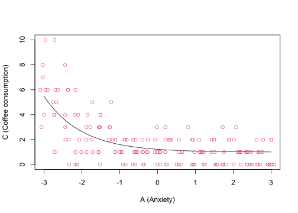
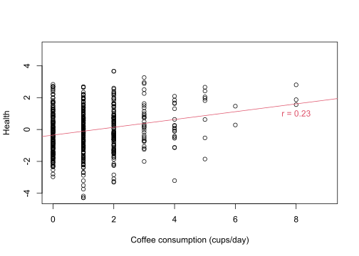

Confounding Coffee
================
Yongfu Liao
Jan 9, 2024

This is a toy example demonstrating how confounding can arise in
statistical modeling. There are many many great examples out there, but
I find the example here quite illuminating. Note that this example is
presented **only for demonstration purposes** and do not intend to
suggest anything about the empirical findings. We simply need better
designed studies to elucidate the relationship between coffee
consumption and health. This demonstration, however, still serves well
to (re)emphasized the importance of being careful with casual claims.

## Is coffee good for health?

There are accumulating evidence showing that the amount of [coffee
intake is associated with health
outcomes](https://en.wikipedia.org/wiki/Health_effects_of_coffee). In
particular, it was found that having more coffee is associated with
lower all-cause mortality, in a reasonable range of dosage.

> Does this mean that **drinking coffee leads to better health**?

Nope, we have to be careful for **alternative explanations** that also
describe the observed phenomenon. One of such explanations may simply be
that less healthy people avoid coffee. This can happen when people prone
to anxiety tend to reduce coffee intake. The directed acyclic graph
(DAG) below explicates this. The variable $A$ stands for the anxiety
level of a person, which negatively impacts his or her health ($H$).
Anxiety also influences the amount of coffee one consumes ($C$) since
caffeine in coffee amplifies anxiety and anxiety-prone people know this
and avoid drinking too much coffee.


In some sense, the amount of coffee intake in this fictitious example
serve as a **segregating device** which separates (continuously) health
people from the unhealthy. Therefore, more coffee intake indexes
healthier people (i.e., those who are less anxiety-prone), and less
coffee intake signals less health people.

## Data Generative Process

To explicate the above reasoning formally, let’s lay out a data
generative process for the DAG. I’ll first describe it in math symbols
and then in code.

$$
\begin{aligned}
C         & \sim \text{Poisson}(\lambda) \\
\lambda & = \frac{1}{\text{logistic}(A + 1.5)} \\
H         & \sim \text{Normal}(-A, 1) \\
A         & \sim \text{Normal}(0, 1)
\end{aligned} \tag{1}
$$

The equations in (1) should be easier to read from bottom to top. The
last two lines state how health is related to anxiety in a population,
which describe formally the causal relationship $\overrightarrow{AH}$ in
the DAG. The term $\lambda$ characterizes the Poisson distribution that
generates the amount of coffee intake $C$ (cups of coffee day).
$\lambda$ is also the expectation of the Poisson distribution, which
amounts to the expected number of “cups of coffee per day” here. The
expression $\frac{1}{\text{logistic}(A + 1.5)}$ is used to link anxiety
levels to the expected amount of coffee intake such that they have a
negative relationship (i.e., higher anxiety leads to lower coffee
consumption). The $1.5$ term is added to $A$ in order to shift the draws
from the Poisson distribution to a reasonable range (i.e., to about
8-10, instead of 20-30, cups of coffee for the upper bound). This is
illustrated in the figure below.

``` r
logistic = function(x) 1 / (1 + exp(-x))
f = function(x) 1 / logistic(x + 1.5)

# Relationship between lambda (expected value of C) & A
curve( f(x), from=-3, to=3,
       xlab="A (Anxiety)", ylab="C (Coffee consumption)", ylim=c(0,10))

# Relationship between C & A
for ( x in seq(-3,3,by=.3) ) {
    lambda = f(x)
    x_jitter = rep(x,8) + runif(8,-.1,.1)
    points(x_jitter, rpois(8,lambda), col=2)  # draw 8 points for each A
}
```

<!-- -->

### Simulation

The code below reproduces the generative model in (1). Five hundred
participants are simulated to demonstrate this spurious relationship
between coffee and health.

``` r
set.seed(777)
N = 500
A = rnorm(N)
lambda = 1 / logistic(A+1.5)
C = rpois(N, lambda)
H = rnorm(N, -A)
```

With the synthetic data, let’s visualize the misleading positive
relationship between coffee consumption and health.

``` r
traj = lm(H ~ C)
plot(C, H, 
     xlab="Coffee consumption (cups/day)", ylab="Health", xlim=c(0,9))
a = traj$coefficients[1]; b = traj$coefficients[2]
abline(a, b, col=2)
text(8, a+b*8 - .6, paste("r =", round(cor(C,H),2)), col=2)
```

<!-- -->

<style>
img {
display: block;
margin: 0 auto;
padding: 0 auto;
background: white;
}
strong, b {
color: red;
}
</style>
