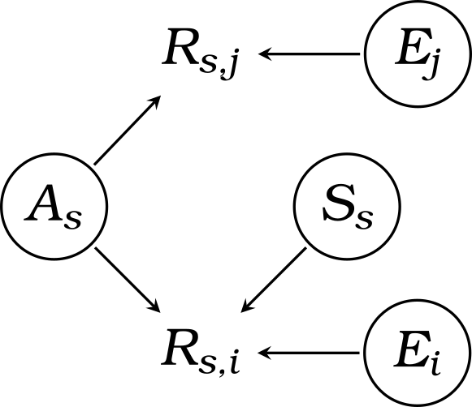

A mixed-type Item Response Model
================================

Goals
-----

The models here are a proof of concept that respondents' subjective biases in self-reported responses could be teased out from the ability estimates if objective items---namely, items that are unaffected by subjective biases---are simultaneously incorporated in a scale/test. 

The DAG below sketches the generative processes assumed. Here, $E$ stands for item easiness; $A$, the (true) person ability; $S$, the subjective bias when responding to subjective items (e.g., self-reported ratings); and $R$, the item response. The subscripts $s$, $i$, and $j$ index the respondent, the subjective item, and the objective item, respectively.




Reproduce
---------

The commands below[^n1] run the simulation and then fit two models to the simulated data to check for parameter recovery. 

```sh
# Execute in-order
snakemake simulation -c
snakemake fit_m1 -c
snakemake fit_m2 -c
snakemake simulation fit_m1 fit_m2 --detailed-summary -c | fileDAG > fig/workflow.svg
```

The details of the workflow could be traced down in [`Snakefile`](Snakefile). The graph below summarises the dependencies among the scripts and files used in simulations and model fitting.


[^n1]: Note that on Windows, the stan models may need to be compiled manually in an interactive R session. This seems to be a bug related to `make` path (which functions properly when running `cmdstanr` in interactive R sessions).
